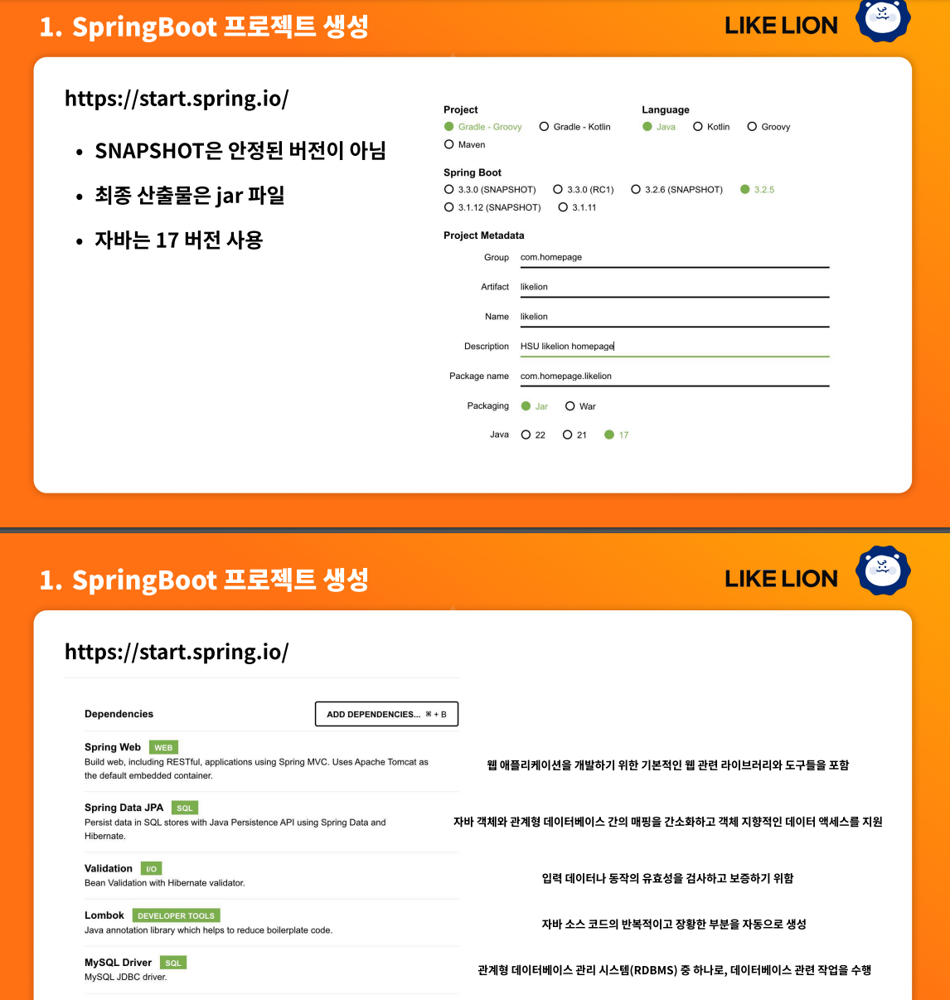
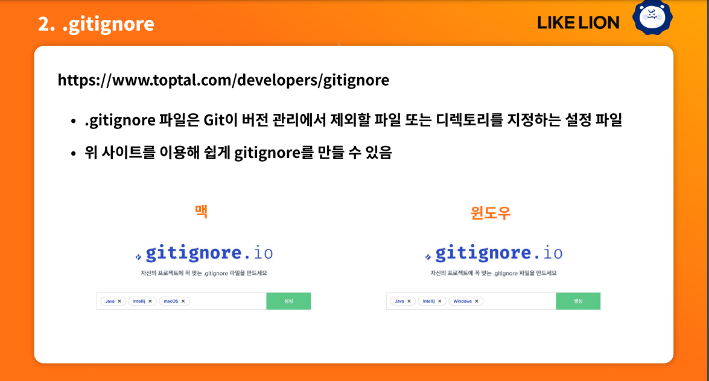

# likelion-homepage
# 프로젝트 생성 spring boot 프로젝트를 생성하고 필요한 라이브러리를 끌어옵니다.

# gitignore 설정

# application.properties에서 mysql을 사용하기위한 설정을 작성
spring.application.name=likelion

#DB (local)
spring.datasource.url=jdbc:mysql://localhost:3306/likelion
spring.datasource.username=root
spring.datasource.password=1234

#show SQL
spring.jpa.properties.hibernate.format_sql=true

spring.jpa.hibernate.ddl-auto=create
# ResposeEntity를 사용하여 각종 api에 대한 응답을 보냅니다.
public class SimpleTestController {

@GetMapping("/success")  
public String simpleTextSuccess() {
return "안녕";
}

@GetMapping("/fail")  
public ResponseEntity<String> simpleTextFail() {  
return ResponseEntity.status(HttpStatus.BAD_REQUEST)
                      .body("실패"); }
}
# 본격적으로 ResposeEntity를 활용합니다(CustomApiResponse작성밎 활용)

# CustomApiResponse
public class CustomApiResponse<T> {
private int status;
private T data;

    private String message;

    public static <T> CustomApiResponse<T> createSuccess(int status, T data, String message){
        return new CustomApiResponse<>(status, data, message);
    }
    public static <T> CustomApiResponse<T> createFailWithout(int status,String message){
        return new CustomApiResponse<>(status, null,message);
    }

}
# 활용
public class CustomTestController {  
@PostMapping("/simple")  
public ResponseEntity<CustomApiResponse<?>> simple() {
CustomApiResponse<Object> responseBody = CustomApiResponse.createSuccess(HttpStatus.OK.value(), null, "회원가입에 성공하였습니다");  
return ResponseEntity.status(HttpStatus.OK).body(responseBody);  
}

    @GetMapping("/jsonData")
    public ResponseEntity<CustomApiResponse<?>> jsonData() {
        //SimpleDto dto = new SimpleDto("example", "example@naver.com");
        SimpleDto dto = SimpleDto.builder()
                .userid("example")
                .email("example@naver.com")
                .build();

        CustomApiResponse<Object> responseBody = CustomApiResponse.createSuccess(HttpStatus.OK.value(), dto, "회원 조회에 성공하였습니다");
        return ResponseEntity.status(HttpStatus.OK).body(responseBody);
    }
}
# api에서 오류를 반환할때
public class CustomErrorController implements ErrorController {
@RequestMapping("/error")  
public ResponseEntity<CustomApiResponse<?>> handleError(HttpServletRequest request) {  
//HttpServletRequest 로부터 status code 가져오기
Object status = request.getAttribute(RequestDispatcher.ERROR_STATUS_CODE);  
if (status != null)   
{

            int statusCode= Integer.parseInt(status.toString());
            // Bad Request (400)
            if (statusCode ==400)//statusCode ==HttpStatus.BAD_REQUEST.value())
            {
                return ResponseEntity
                        .status(HttpStatus.BAD_REQUEST)
                        .body(new CustomApiResponse<>(HttpStatus.BAD_REQUEST.value(),null,"잘못된 요청입니다."));
            }

            //Forbidden (403)
            else if (statusCode ==403)//statusCode ==HttpStatus.FORBIDDEN.value())
            {
                return ResponseEntity
                        .status(HttpStatus.FORBIDDEN)
                        .body(new CustomApiResponse<>(HttpStatus.FORBIDDEN.value(),null,"접근이 금지되었습니다."));
            }
            //Notfound (404)
            else if (statusCode ==404)//statusCode ==HttpStatus.NOT_FOUND.value())
            {
                return ResponseEntity
                        .status(HttpStatus.NOT_FOUND)
                        .body(new CustomApiResponse<>(HttpStatus.NOT_FOUND.value(),null,"페이지를 찾을수없습니다."));
            }
            //Method Not Allowed (405)
            else if (statusCode ==405)//statusCode ==HttpStatus.METHOD_NOT_ALLOWED.value())
            {
                return ResponseEntity
                        .status(HttpStatus.METHOD_NOT_ALLOWED)
                        .body(new CustomApiResponse<>(HttpStatus.METHOD_NOT_ALLOWED.value(),null,"허용되지 않은 페이지 입니다."));
            }
            //Server Internet error (500)
            else{
                return ResponseEntity
                        .status(HttpStatus.INTERNAL_SERVER_ERROR)
                        .body(new CustomApiResponse<>(HttpStatus.INTERNAL_SERVER_ERROR.value(),null,"내부 서버 오류가 발생하였습니다."));
            }
        }
        else{
            return ResponseEntity
                    .status(HttpStatus.INTERNAL_SERVER_ERROR)
                    .body(new CustomApiResponse<>(HttpStatus.INTERNAL_SERVER_ERROR.value(),null,"내부 서버 오류가 발생하였습니다."));
        }
    }
}
# 회원가입 api 작성
public class UserService {

    private final UserRepository userRepository;

    //회원가입 작성~
    public ResponseEntity<CustomApiResponse<?>>signup(UserSignupDto dto){
        // 회원이 존재하는지? -> userId 고유하기때문
        Optional<User> findUser = userRepository.findByUserId(dto.getUserId());

        //동일한 userId의 경우 회원가입 불가 -> CustomApiResponse create Fail 데이터 반환\
        if(findUser.isPresent()){
            return ResponseEntity.status(HttpStatus.BAD_REQUEST)
                    .body(CustomApiResponse.createFailWithout(HttpStatus.BAD_REQUEST.value(), "중복된 아이디 입니다."));

        }
        //동일한 userId가 없다 -> 회원가입 진행
        User   newUser = User.builder()
                .userId(dto.getUserId())
                .email(dto.getEmail())
                .password(dto.getPassword())
                .build();
        // 새로운 user 저장
        userRepository.save(newUser);
        return  ResponseEntity
                .status(HttpStatus.OK)
                .body(CustomApiResponse.createSuccess(HttpStatus.OK.value(), null,"회원가입에 성공하였습니다."));

    }
}

